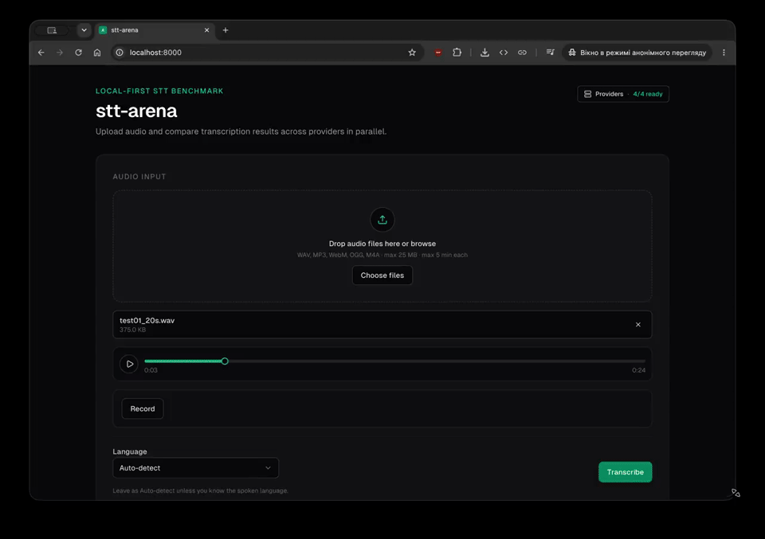

# stt-arena

Compare Speech-to-Text providers side by side. Upload audio once, transcribe in parallel, and review transcripts, latency, confidence, and rough cost estimates in card, table, and compare views.

<p align="center">
  <a href="https://github.com/Reidond/stt-arena/raw/main/docs/preview.mp4">
    
  </a>
</p>
<p align="center"><sub>Preview (12s) · <a href="https://github.com/Reidond/stt-arena/raw/main/docs/preview.mp4">Watch full demo (MP4)</a></sub></p>

## Requirements

- Python 3.13+
- [uv](https://docs.astral.sh/uv/)
- Node.js 20+ (Vite asset pipeline)
- **ffmpeg** and **ffprobe** on `PATH` (decode/normalize MP3, WebM, OGG, M4A)

## Quick start

```bash
git clone <repo-url> stt-arena
cd stt-arena
cp .env.example .env
uv sync
uv run dev
```

Open http://127.0.0.1:8000

**Production:**

```bash
uv run build
uv run start
```

## Configuration

Copy `.env.example` to `.env`. All settings load via Pydantic Settings.

### Providers

Enable providers with a comma-separated list:

```env
ENABLED_PROVIDERS=openai_whisper,deepgram,google,xai_grok
```

| Provider ID | Model (default) | Env override |
|-------------|-----------------|--------------|
| `openai_whisper` | `gpt-4o-transcribe` | `OPENAI_TRANSCRIBE_MODEL`, `OPENAI_DIARIZE_MODEL` |
| `deepgram` | `nova-3` | `DEEPGRAM_MODEL` |
| `google` | `chirp_3` (Speech-to-Text v2) | `GOOGLE_SPEECH_MODEL`, `GOOGLE_SPEECH_REGION` |
| `xai_grok` | Grok STT REST (latest server-side) | — |

Google requires `GOOGLE_STORAGE_BUCKET` for audio longer than 60 seconds (Chirp 3 batch path).
OpenAI diarization uses `gpt-4o-transcribe-diarize` by default and requests
speaker-annotated segments with automatic server-side chunking.
xAI diarization sends `diarize=true` and formats the returned word-level
speaker annotations into readable turns.
Deepgram enables its language detector when the language selector is left on
Auto-detect; otherwise Deepgram defaults to English.

Providers with missing credentials appear as **unavailable** in the UI and are skipped during transcription.

### Google Cloud STT

1. Enable **Cloud Speech-to-Text API** and billing on your GCP project.
2. Create a service account with **Cloud Speech Client** and **Service Usage Consumer**.
3. Download the JSON key and set `GOOGLE_APPLICATION_CREDENTIALS` to its absolute path.
4. For clips longer than 60 seconds, create a GCS bucket and set `GOOGLE_STORAGE_BUCKET`. Grant the service account **Storage Object Creator** (and delete) on that bucket. Audio is uploaded temporarily for Chirp 3 batch transcription and removed afterward.

### Limits

| Variable | Default | Description |
|----------|---------|-------------|
| `MAX_UPLOAD_MB` | `25` | Max upload size |
| `MAX_AUDIO_DURATION_SEC` | `900` | Max audio duration |
| `PROVIDER_TIMEOUT_SEC` | `120` | Per-provider timeout (cloud APIs) |
| `PROVIDER_MAX_ATTEMPTS` | `3` | Maximum attempts for transient provider failures |
| `PROVIDER_RETRY_BASE_DELAY_SEC` | `1.0` | Initial retry delay; doubles after each failed attempt |
| `PROVIDER_RETRY_MAX_DELAY_SEC` | `8.0` | Maximum delay between provider attempts |
| `OPENAI_DIARIZE_TIMEOUT_SEC` | `600` | OpenAI diarization requests for longer recordings |
| `GOOGLE_BATCH_TIMEOUT_SEC` | `600` | Chirp 3 batch jobs for audio > 60s |

### Logging

Runtime logs are written to `logs/stt-arena.log` by default and rotate at 5 MB with five backups.
Provider failures include per-attempt context and stack traces. Transient failures
such as network errors, TLS errors, timeouts, rate limits, and server errors are
retried with bounded exponential backoff.

| Variable | Default | Description |
|----------|---------|-------------|
| `LOG_LEVEL` | `INFO` | Python logging level |
| `LOG_DIR` | `logs` | Log directory, relative to the repo unless absolute |
| `LOG_FILE` | `stt-arena.log` | Active log filename |
| `LOG_MAX_BYTES` | `5242880` | Rotation size for the active log file |
| `LOG_BACKUP_COUNT` | `5` | Number of rotated log files to keep |

### Billing plans

Each provider uses a configurable billing plan that mirrors official list pricing, rounding rules, and free tiers. Set plan IDs via `BILLING_PLAN_<PROVIDER>` (see `.env.example`). List all plans with `GET /api/billing/plans`.

| Variable | Default | Description |
|----------|---------|-------------|
| `BILLING_PLAN_OPENAI_WHISPER` | `gpt-4o-transcribe` | OpenAI model/plan |
| `BILLING_PLAN_DEEPGRAM` | `nova-3-batch-payg` | Deepgram model + tier |
| `BILLING_PLAN_GOOGLE` | `google-v2-standard-tier1` | Google API version + tier |
| `BILLING_PLAN_GOOGLE` | `google-v1-standard-logging` | Google API version + tier |
| `BILLING_PLAN_XAI_GROK` | `xai-stt-batch` | xAI STT mode |
| `BILLING_MONTHLY_MINUTES_*` | `0` | Minutes already used this month (for free/volume tiers) |

Result cards show plan name, billable duration, and computed cost. Failed transcriptions are not billed (matching Google’s policy; other providers may differ).

## Usage

1. Open the app — the **Providers** panel shows which STT backends are enabled and configured.
2. **Drop** one or more audio files, use the file picker, or **Record** from your microphone.
3. Preview the waveform (when supported by your browser).
4. Optionally set a language code (e.g. `en`) and enable speaker diarization.
5. Click **Transcribe** — loading cards appear immediately; each provider’s result replaces its card as it finishes.
6. **Export** results as JSON or CSV when all files complete.
7. Compare transcript text, latency, word count, confidence (when supported), and cost under your configured billing plan.

Supported formats: WAV, MP3, WebM, OGG, M4A.

## API

- `GET /api/providers` — provider list and availability
- `GET /api/billing/plans` — billing plan catalog and active plan per provider
- `POST /api/transcribe` — multipart upload with optional `language` and `diarization` fields; JSON batch response, or a JSON session response with `X-Progressive: 1`
- `GET /api/transcribe/sessions/{id}/events` — SSE stream of per-provider results

See [SPEC.md](./SPEC.md) for request/response shapes.

## Security

The app binds to `127.0.0.1` by default. If you set `HOST=0.0.0.0`, anyone on your network can upload audio without authentication — only do this on trusted networks.

## Development

```bash
uv run dev     # FastAPI + Vite (HMR for assets)
uv run build   # Production asset build → src/stt_arena/static/dist/
uv run start   # Production server (requires build first)
```

`uv run dev` serves the browser-facing app on `:8000`. Vite runs behind FastAPI
over a Unix socket in the system temp directory, so it does not reserve a
second TCP port.

Provider adapters and provider-domain behavior live in the
`stt-arena-providers` workspace package. The FastAPI application consumes them
through its `ProviderService` facade.

## License

See repository license file if present.
